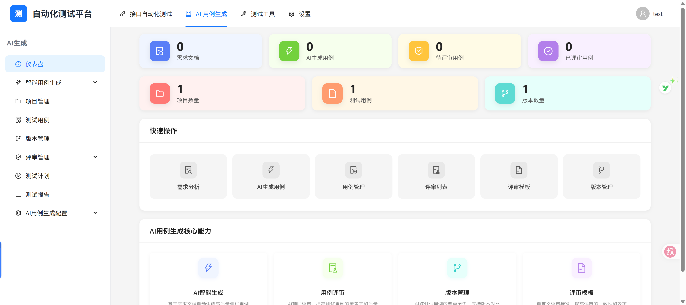
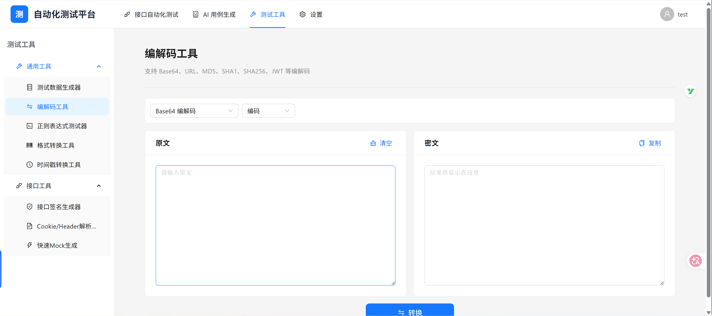

# QAgent 智能自动化测试平台

<div align="center">

**基于 AI 驱动的全栈测试管理平台**

[](https://www.python.org/)
[](https://www.djangoproject.com/)
[](https://reactjs.org/)
[](https://ant.design/)
[](LICENSE)

</div>

## 📖 项目简介

QAgent 是一个功能强大的智能自动测试平台，集成了 AI 需求分析、测试用例生成、API 自动化测试、UI 自动化测试、测试用例管理、评审、执行和报告等完整功能。

<div align="center">
  
  
</div>

## ✨ 核心特性

### 🤖 AI 智能化能力
- **AI 需求分析**: 自动解析需求文档（PDF/Word/TXT），智能提取业务需求
- **智能测试用例生成**: 基于需求自动生成测试用例，支持多种测试类型
- **多模型支持**: 支持 DeepSeek、通义千问、硅基流动、OpenAI、Anthropic、Google Gemini 等多种 AI 模型
- **AI 驱动 UI 自动化**: 基于 browser-use 和 LangChain，实现智能化浏览器自动化

### 🔐 安全机制
- **JWT 认证**: 采用企业级 JWT 双 Token 安全机制
- **自动刷新**: Access Token 过期前自动刷新，无感续期
- **Token 黑名单**: 登出时自动将 Token 加入黑名单，防止重放攻击
- **请求队列**: Token 刷新期间请求自动排队等待，确保请求不丢失

### ⚙️ 统一配置中心
- **环境检测**: 自动检测系统浏览器和 Playwright 环境
- **驱动管理**: 一键安装和更新浏览器驱动
- **AI 模型配置**: 统一管理多种 AI 模型的 API 配置
- **连接测试**: 支持 AI 模型连接测试和验证

### 📋 测试用例管理
- **完整的用例生命周期管理**: 创建、编辑、版本控制、归档
- **灵活的用例组织**: 支持项目、版本、标签等多维度分类
- **详细的用例步骤**: 支持步骤化用例设计，包含前置条件、操作步骤、预期结果
- **附件和评论**: 支持用例附件上传和团队协作评论

### 🔍 测试用例评审
- **评审流程管理**: 支持多人评审、评审模板、检查清单
- **评审状态跟踪**: 待评审、评审中、已通过、已拒绝等状态管理
- **评审意见记录**: 支持整体意见、用例意见、步骤意见等多层级反馈
- **评审模板**: 可自定义评审检查清单和默认评审人

### 🌐 API 测试
- **项目和集合管理**: 支持 HTTP/WebSocket 协议，树形结构组织 API
- **请求管理**: 支持 GET/POST/PUT/DELETE/PATCH/HEAD/OPTIONS 等多种 HTTP 方法
- **环境变量**: 全局和局部环境变量管理，支持变量替换
- **测试套件**: 批量执行 API 请求，支持断言和执行顺序配置
- **请求历史**: 完整的请求执行历史记录和结果追踪
- **定时任务**: 支持定时执行测试套件，邮件/Webhook 通知
- **测试报告**: 自动生成 Allure 测试报告


### 📊 测试执行与报告
- **测试计划**: 创建测试计划，关联项目、版本和测试用例
- **测试执行**: 手动和自动化测试执行，实时记录测试结果
- **执行历史**: 完整的执行历史追踪和结果对比
- **测试报告**: 多维度数据统计和可视化图表
- **Allure 集成**: 支持生成专业的 Allure 测试报告

### 👥 项目与团队管理
- **项目管理**: 多项目支持，项目成员和角色管理
- **版本管理**: 版本规划和测试用例关联
- **权限控制**: 基于项目的成员角色权限管理
- **用户配置**: 个性化用户设置和偏好配置

## 🏗️ 技术架构

### 后端技术栈
- **框架**: Django 4.2 + Django REST Framework
- **数据库**: MySQL 8.0+ (PyMySQL)
- **API 文档**: drf-spectacular (Swagger/ReDoc)
- **安全认证**: JWT (rest_framework_simplejwt) + Token 黑名单
- **后台管理**: Django SimpleUI
- **异步任务**: Celery + Redis
- **实时推送**: Django Channels + Daphne + Redis
- **AI 集成**:
  - browser-use: AI 驱动的浏览器自动化
  - langchain-openai: LLM 集成框架
  - 多模型支持：OpenAI、Anthropic、Google Gemini、DeepSeek、硅基流动等
- **自动化测试**: Selenium, Playwright, Airtest, Allure
- **HTTP 客户端**: httpx (异步 HTTP)
- **定时任务**: Django APScheduler
- **OCR 支持**: EasyOCR + OpenCV
- **PDF/Word 处理**: PyPDF2, python-docx

### 前端技术栈
- **框架**: React 19.2 + React Router DOM 7.14
- **UI 组件**: Ant Design 6.3
- **状态管理**: Redux Toolkit 2.11 + React Redux 9.2
- **构建工具**: Vite 8.0
- **HTTP 客户端**: Axios 1.15
- **国际化**: i18next 26.0
- **图表可视化**: ECharts 6.0
- **代码编辑器**: Monaco Editor 0.55
- **日期处理**: Day.js 1.11
- **工具库**: Lodash 4.18

## 🚀 快速开始

### 环境要求

- **Python**: 推荐 Python 3.12，其他版本可能会存在兼容性问题
- **Node.js**: 18+ (开发环境必须安装 Node.js 用于构建前端项目，生产可不安装)
- **MySQL**: 8.0+ (必须安装 MySQL 客户端，用于执行数据库迁移等操作)
- **Java**: 17+ (可选，用于运行浏览器驱动、Allure 报告生成等，否则会生成报告失败)
- **Redis**: 6.0+ (可选，用于 APP 自动化测试、异步任务和 WebSocket 推送等)
- **浏览器驱动**: ChromeDriver / GeckoDriver (用于 UI 自动化，建议提前下载好)

### 后端部署

1. **克隆项目**
```bash
git clone <repository-url>
cd QAgent
```

2. **创建虚拟环境**
```bash
python -m venv venv
# Windows
venv\Scripts\activate
# Linux/Mac
source venv/bin/activate
```

3. **安装依赖**
```bash
pip install -r requirements.txt
```

4. **配置环境变量**
```bash
# 复制示例配置文件到 .env 文件
# 按照.env文件模板配置你的数据库连接信息等
cp .env.example .env
```

5. **初始化数据库**
```bash
# 创建数据库
mysql -u root -p
CREATE DATABASE QAgent CHARACTER SET utf8mb4 COLLATE utf8mb4_unicode_ci;
EXIT;

# 执行迁移
python manage.py makemigrations
python manage.py migrate

# 创建超级用户
python manage.py createsuperuser
```

6. **启动服务**
```bash
# 启动 Django 开发服务器
python manage.py runserver
```

### 前端部署

1. **安装依赖**
```bash
cd web
npm install
```

2. **启动开发服务器**
```bash
npm run dev
```

3. **构建生产版本**
```bash
npm run build
```

### 访问应用

- **前端**: http://localhost:5173
- **后端 API**: http://localhost:8000
- **API 文档**: http://localhost:8000/api/docs/
- **Admin 后台**: http://localhost:8000/admin/

## 📝 项目结构

```
QAgent/
├── apps/                   # Django 应用
│   ├── api_testing/        # API 测试模块
│   ├── assistant/          # AI 助手模块
│   ├── core/               # 核心功能模块
│   ├── executions/         # 测试执行模块
│   ├── projects/           # 项目管理模块
│   ├── reports/            # 报告模块
│   ├── requirement_analysis/  # 需求分析模块
│   ├── reviews/            # 评审模块
│   ├── testcases/          # 测试用例模块
│   ├── testsuites/         # 测试套件模块
│   ├── users/              # 用户管理模块
│   └── versions/           # 版本管理模块
├── backend/                # Django 项目配置
│   ├── settings.py         # 项目设置
│   ├── urls.py             # 主路由
│   └── ...
├── web/                    # React 前端项目
│   ├── src/
│   │   ├── pages/          # 页面组件
│   │   ├── components/     # 公共组件
│   │   ├── services/       # API 服务
│   │   ├── store/          # Redux 状态管理
│   │   └── ...
│   └── package.json
├── manage.py               # Django 管理脚本
├── requirements.txt        # Python 依赖
├── .env.example            # 环境变量示例
└── README.md               # 项目说明文档
```

## 📝 许可证

本项目采用 MIT 许可证 - 详见 [LICENSE](LICENSE) 文件

## 📧 联系方式

如有问题或建议，欢迎通过 Issue 反馈。

---


